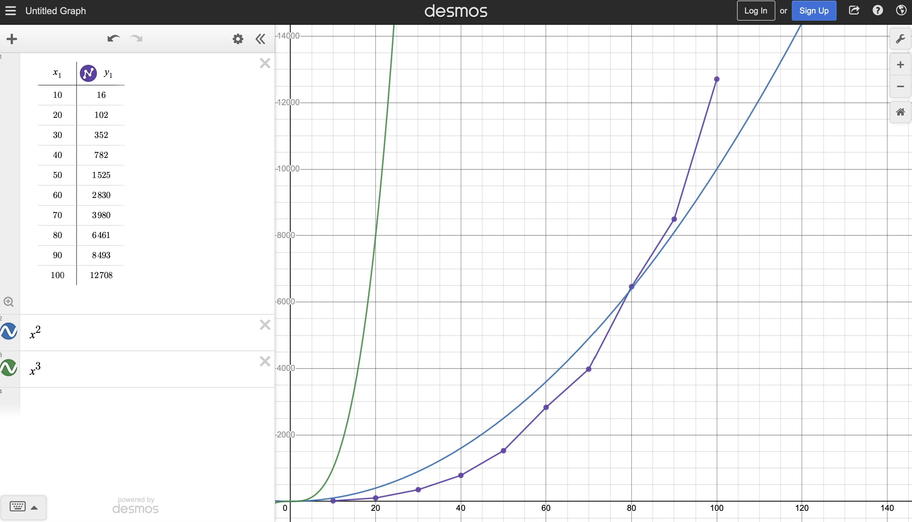

# Algorithm Analysis

## Space Complexity

In the solution shown here, the string input is transformed into a 2D array for processing. Since this data structure has the same number of elements as the size of the grid, the space complexity of the algorithm is `O(n)`. (It is possible to implement the solution by examining the string input directly, in which case the space complexity would be `O(1)`.)

Note that the inner `for` loop appears to be a Gauss summation, but this does not apply because the loop bound is at most `√n`, not `n`.

## Time Complexity

`getValidSquares` iterates over all elements of the grid (`n` iterations), and for each element, it performs a number of checks equal to the smallest side of the grid. Since the smallest side is at most the square root of `n` (when the grid is a square), the big-O time complexity is `n√n = n^1.5 = O(n²)`.

## Empirical Evidence

The graph shows `n^2`, `n^3`, and the empirical data. The data most closely follows `n^2` and does not approach the `n^3` growth rate.
